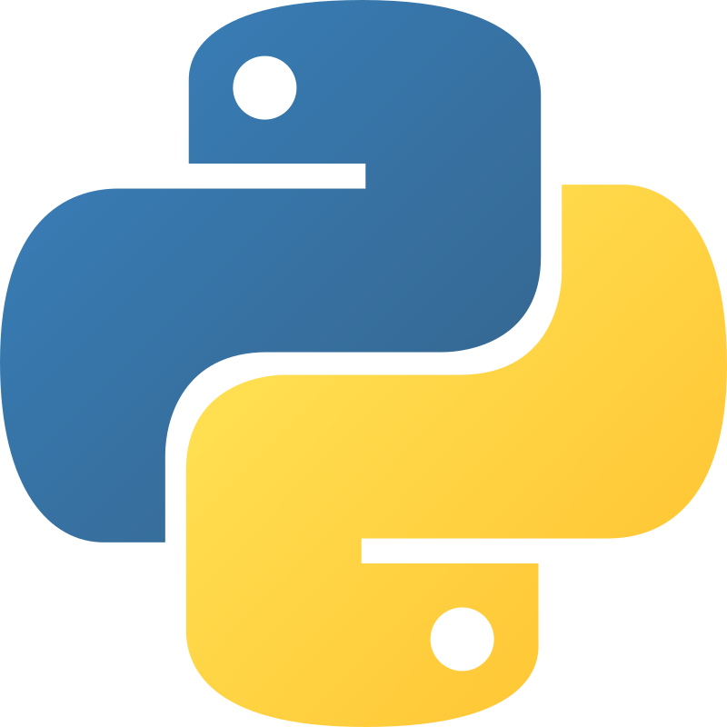

# My Python Programming
The storage for all Python codes, projects, and works

## Useful Python tools

Python.org: https://www.python.org/

Visual Studio Code: https://code.visualstudio.com/download

PyCharm: https://www.jetbrains.com/pycharm/download/?section=mac

Thonny: https://thonny.org

Python Compiler Online: https://www.programiz.com/python-programming/online-compiler/

